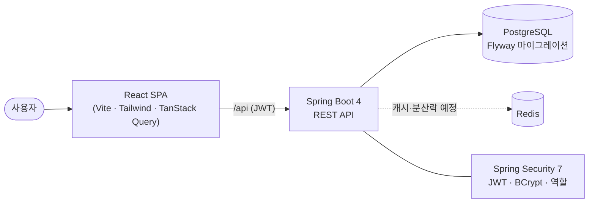

# SpaceFlow

> 스터디룸·회의실을 **시간 단위로 예약**하는 멀티테넌트 SaaS.
> 스터디카페 사장님이 공간을 등록하고, 이용자가 웹에서 시간대를 골라 예약·결제합니다.

<!-- 배포 URL: (예정) · 데모 계정 owner@demo.com / password123 -->

호텔 PMS 실무 경험을 살려 **예약 도메인**을 최신 스택으로 재설계한 개인 프로젝트입니다.
"돌아가는 CRUD"가 아니라 **동시성·요금정책·멀티테넌시** 같은 실제로 어려운 문제를 어떻게 푸는지에 집중했습니다.

## 핵심 기능

- 🔒 **동시 예약 정합성** — 같은 방·같은 시간 중복 예약 방지 (락 3종 + DB 제약 비교, 부하테스트로 증명)
- 💰 **요금정책 엔진** — 피크/주말/장시간 할인을 코드가 아닌 **데이터로** 관리, 실시간 견적
- 🏢 **멀티테넌시** — 여러 사업자 데이터 격리 (사장은 자기 매장 예약만)
- 🔑 **JWT 인증/인가** — BCrypt, 역할(OWNER/GUEST), Spring Security 7
- 🖥️ **풀스택** — React SPA ↔ Spring Boot API

## 기술 스택

| 레이어 | 기술 |
|--------|------|
| 언어/런타임 | Java 21 (LTS) |
| 백엔드 | Spring Boot 4.1, Spring Security 7, Spring Data JPA |
| 데이터 | PostgreSQL 16, Flyway, (Redis 예정) |
| 프론트엔드 | React 19, TypeScript, Vite, Tailwind CSS, TanStack Query |
| 인프라 | Docker Compose, (GitHub Actions·배포 예정) |
| 테스트 | JUnit 5, Testcontainers, (k6 예정) |

## 아키텍처



- 개발 중엔 프론트(:5173)와 백엔드(:8080)가 분리되어 돌고, Vite 프록시로 연결합니다.
- 스키마는 전부 **Flyway 마이그레이션(V1~V7)** 으로 버전관리됩니다.

## 핵심 기술 이야기

### 1. 동시 예약 정합성 — "같은 방, 같은 시간, 한 명만"

예약은 `확인(비었나?) → 저장` 2단계라, 동시 요청이 그 틈에 끼어들면 **중복 예약**이 생깁니다(TOCTOU 경쟁상태).
스레드 20개로 같은 슬롯을 동시에 예약해 이를 재현하고, **3가지 방식**으로 막은 뒤 결과를 비교했습니다.

| 방식 | 범주 | 동시 20요청 → 확정 예약 |
|------|------|------------------------|
| 순진한 (방어 X) | — | ❌ **10건 중복** |
| 비관적 락 (`SELECT … FOR UPDATE`) | 앱 락 | ✅ 1건 |
| 낙관적 락 (`@Version` 강제증가) | 앱 락 | ✅ 1건 |
| **PostgreSQL `EXCLUDE` 제약** (`btree_gist` + `tstzrange`) | DB 제약 | ✅ 1건 |

**운영 채택: `EXCLUDE` 제약 + 앱 사전확인.**
DB가 겹치는 예약을 물리적으로 거부하므로 다중 서버에서도 안전하고, 겹치지 않는 예약은 동시에 모두 통과합니다.
앱 사전확인은 대부분의 겹침을 친절한 409로 안내하고, 그 틈을 뚫은 요청은 DB 제약이 최후 방어선이 됩니다.
> 통합테스트(Testcontainers)로 위 표를 그대로 검증합니다.

### 2. 데이터 기반 요금정책 엔진

요금 규칙(피크·요일·장시간)을 하드코딩하지 않고 `pricing_rule` 테이블에 데이터로 두어, **규칙 추가 시 코드 수정이 필요 없습니다.**
견적은 우선순위 순으로 규칙을 적용하고 **내역**을 함께 반환합니다.

```
토요일 저녁 4시간 (기본 10,000원/시간)
  기본요금(4시간)      40,000원
  피크시간(18~22) +50%  +20,000원
  토요일 +30%          +18,000원
  4시간 이상 -10%       -7,800원
  ───────────────────────────
  합계                 70,200원
```

돈은 부동소수점 오차를 피하기 위해 전 계산을 **`BigDecimal`** 로 처리하고, 예약 시점 금액을 **스냅샷**으로 저장해 정책이 바뀌어도 과거 예약 금액을 보존합니다.

### 3. 멀티테넌시 — 데이터 격리

사장(OWNER)은 자기 테넌트의 예약만 볼 수 있습니다. 핵심은 **tenantId를 요청이 아니라 인증된 사장의 JWT에서 꺼내는 것** — 사용자가 남의 테넌트를 지정할 수 없습니다. "사장 A는 사장 B의 데이터를 볼 수 없다"를 MockMvc 통합테스트로 검증합니다.

## 화면

- **방 목록** → 방 선택 → **예약**(날짜·시간 선택 시 요금 실시간 갱신) → 확정
- **로그인/회원가입** (JWT)
- **사장님 대시보드** — 우리 매장 예약 목록 + 매출 합계

<!-- 스크린샷/데모 GIF 추가 예정 -->

## 로컬 실행

```bash
# 1. 인프라(PostgreSQL) 기동
docker compose up -d

# 2. 백엔드 (Java 21 필요)
cd backend && ./gradlew bootRun          # http://localhost:8080

# 3. 프론트엔드
cd frontend && npm install && npm run dev # http://localhost:5173
```

데모 계정: `owner@demo.com` / `password123` (사장), 회원가입 시 손님(GUEST) 생성.

## 테스트

```bash
cd backend && ./gradlew test   # Testcontainers로 실제 Postgres 기동
```

- 동시성 비교(순진/비관/낙관/EXCLUDE), 요금 계산 시나리오, 멀티테넌시 격리 등 통합테스트 포함.

## 프로젝트 구조

```
spaceflow/
├── backend/   # Spring Boot 4 — reservation / pricing / auth / owner ... (기능별 패키지)
├── frontend/  # React + TS — pages / api / auth / components
└── docker-compose.yml
```

## 개발 로드맵

- [x] 예약 코어 + **동시성 방지** (락 3종 + EXCLUDE 제약)
- [x] **요금정책 엔진** (데이터 기반 + 견적)
- [x] **인증 + 멀티테넌시** (JWT + 역할 + 테넌트 격리)
- [x] **프론트엔드** (방목록·예약·로그인·대시보드)
- [ ] 운영/증명: **k6 부하테스트 그래프**, 배포, CI/CD
